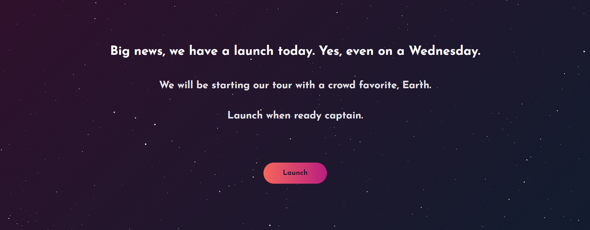
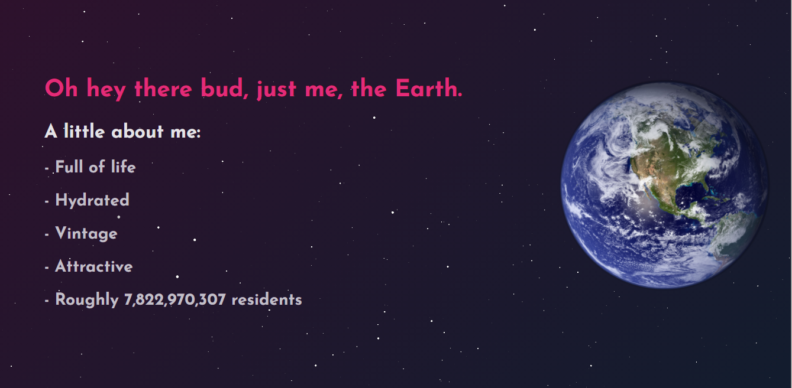

# Welcome to the Launch Pad

An exploration in UX and UI in the theme of a solar system web application. 

 
 

# Live Project

[Live project here](https://stephenamaya.github.io/launchpad/) Enjoy the ride. 

# Details
Lanuchpad was inspired by a simple idea, lets play with viewport height. With just vanilla code and going step by step, I created a infotainment solar system. I used my own [Minty template](https://github.com/stephenamaya/minty-framework) to get started, and off I launched. The idea was to control the UI as much as possible, and create a immersive application-like experience. 
